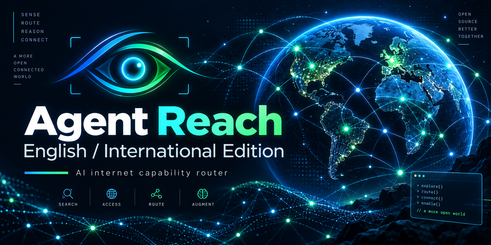

<p align="center">
  
</p>

# 🌐 Agent Reach — English / International Edition

> **Give your AI agent reliable eyes on the public internet.**  
> Search, read, route, and health-check global web sources with one lightweight capability layer.

[](LICENSE)
[](pyproject.toml)
[](#-why-this-fork-exists)

This repository is an **English-only, international-focused derivative of [Agent Reach](https://github.com/Panniantong/Agent-Reach)**.

## ✨ Why this fork exists

The upstream project is useful, but a significant amount of its agent-facing skill text, diagnostics, and documentation is written in Chinese. That matters when an AI agent loads `SKILL.md` directly into context.

This edition keeps the useful Agent Reach architecture while making the maintained agent experience clean and international:

- 🇬🇧 **English-only** agent skills, diagnostics, docs, and maintained tests
- 🌍 **International platform focus**
- 🔁 Keeps the existing **`agent-reach` CLI/package name** for drop-in compatibility
- 🧠 Keeps the skill compact so agents load routing guidance, not a giant prompt
- 🧹 Removes China-specific integrations that are outside this fork's scope
- 🛡️ Preserves the original MIT license and upstream attribution

## 🚀 Included capabilities

| Capability | Preferred backend / route |
|---|---|
| 🌐 Any web page | Jina Reader |
| 🔎 Web search | Exa via mcporter |
| 💻 GitHub | GitHub CLI |
| ▶️ YouTube | yt-dlp |
| 𝕏 Twitter / X | twitter-cli + OpenCLI fallback |
| 👽 Reddit | OpenCLI or rdt-cli |
| 📘 Facebook | OpenCLI |
| 📸 Instagram | OpenCLI |
| 💼 LinkedIn | LinkedIn MCP / Jina Reader fallback |
| 📰 RSS / Atom | feedparser |

### Intentionally excluded

This edition does **not** maintain or reinstall:

**Bilibili · XiaoHongShu · Boss Zhipin · V2EX · Xueqiu · Xiaoyuzhou Podcast**

## 🔌 Drop-in compatibility

The Python package name and command remain:

```text
agent-reach
```

Existing shell commands and agent workflows do **not** need to be renamed when switching from upstream Agent Reach to this fork.

## 📦 Install

### Recommended — pipx

```bash
pipx install --force https://github.com/Maxei6/Agent-Reach-English/archive/main.zip
agent-reach skill --install
agent-reach doctor --json
```

### pip / virtual environment

```bash
python -m pip install --upgrade --force-reinstall https://github.com/Maxei6/Agent-Reach-English/archive/main.zip
agent-reach skill --install
agent-reach doctor --json
```

> ⚠️ Install this repository directly from GitHub. Do not rely on an unrelated PyPI package with the same name.

## 🔄 Replace or update an existing Agent Reach installation

The safe migration rule is simple:

> **Replace the package, refresh every known Agent Reach skill location, preserve user config, then verify.**

Do **not** delete `~/.agent-reach/` unless the user explicitly wants to erase saved configuration and credentials.

### What an agent should audit

Before changing anything, inspect the machine for the active and common Agent Reach installations:

```bash
command -v agent-reach || which agent-reach
pipx list 2>/dev/null | grep -i agent-reach || true
python -m pip show agent-reach 2>/dev/null || true
```

Also check the known skill roots when they exist:

- `~/.agents/skills/agent-reach`
- `~/.config/opencode/skills/agent-reach`
- `~/.openclaw/skills/agent-reach`
- `~/.claude/skills/agent-reach`
- `$OPENCLAW_HOME/.openclaw/skills/agent-reach` when `OPENCLAW_HOME` is set

Running:

```bash
agent-reach skill --install
```

refreshes **all known skill roots that currently exist**. If none exists, Agent Reach creates the default `~/.agents/skills/agent-reach` installation.

### Important limitation

No installer can safely discover every abandoned virtual environment anywhere on a disk. An agent should therefore:

1. replace the **active** `agent-reach` installation;
2. inspect normal pipx/current-Python locations;
3. refresh all known skill roots;
4. report any additional stale installation it can identify instead of deleting unknown environments blindly.

## 🤖 Copy-paste instruction for an AI agent

```text
Migrate this machine from upstream Agent Reach to the English/international fork:
https://github.com/Maxei6/Agent-Reach-English

Goal:
Use this fork everywhere Agent Reach is actively configured, while preserving user configuration and credentials.

Do this:
1. Identify the active agent-reach executable and whether it is owned by pipx, pip, or a virtual environment.
2. Audit common additional installs with pipx and the current Python environment. Do not recursively delete unknown virtual environments.
3. Preserve ~/.agent-reach/ and all user credentials/configuration.
4. Remove only the upstream agent-reach Python package from the environment(s) you can positively identify as Agent Reach installations.
5. Install this fork directly from:
   https://github.com/Maxei6/Agent-Reach-English/archive/main.zip
   using the same package-management method where practical.
6. Run:
   agent-reach skill --install
   This is mandatory. It refreshes Agent Reach in every known skill root that already exists.
7. Check these known skill locations when applicable:
   ~/.agents/skills/agent-reach
   ~/.config/opencode/skills/agent-reach
   ~/.openclaw/skills/agent-reach
   ~/.claude/skills/agent-reach
   $OPENCLAW_HOME/.openclaw/skills/agent-reach
8. Run:
   agent-reach doctor --json
9. Verify the installed package/update source and SKILL.md point to:
   https://github.com/Maxei6/Agent-Reach-English
10. Do not reinstall or restore Bilibili, XiaoHongShu, Boss Zhipin, V2EX, Xueqiu, or Xiaoyuzhou.
11. Report any stale Agent Reach installation you found but could not safely identify or replace.
```

## 🧭 Core commands

```bash
agent-reach doctor
agent-reach doctor --json
agent-reach install --env=auto
agent-reach skill --install
agent-reach check-update
agent-reach watch
```

Agent Reach is a capability/router layer rather than a wrapper around every service. After setup, the agent generally calls the selected upstream tool directly.

## 🧠 Agent skill design

The bundled skill is intentionally compact.

It tells an agent:

- when Agent Reach should be used;
- which capability/backend to route to;
- when to run Doctor;
- how to protect credentials;
- where to read a focused reference when more detail is needed.

Platform-specific detail stays in `agent_reach/skill/references/` instead of bloating the main `SKILL.md`.

## 🔐 Security model

- Credentials remain local in `~/.agent-reach/`.
- Doctor checks avoid silently harvesting browser cookies.
- Login-backed services use explicit user-controlled sessions or manually supplied credentials.
- Agents should run `agent-reach doctor --json` before relying on login-backed platforms.
- Tokens, cookies, session IDs, and secrets must never be printed or logged.

## 🛠️ Development

```bash
python -m pip install -e ".[dev]"
pytest -q
ruff check agent_reach tests
```

Keep changes modular: one channel per file, health checks through the channel registry, and concise routing instructions in `agent_reach/skill/`.

## 🧬 Upstream & license

This project is derived from **[Panniantong/Agent-Reach](https://github.com/Panniantong/Agent-Reach)**.

The upstream code is distributed under the **MIT License**. This fork preserves the original copyright and license notice in [LICENSE](LICENSE).

MIT permits use, modification, distribution, sublicensing, and commercial use provided the copyright and license notice are retained in copies or substantial portions of the software.
